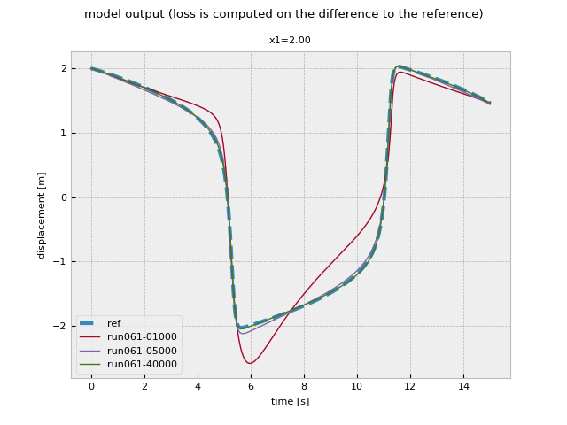

# Introduction

A Van der Pol oscillator can be described as follows:  
$`\ddot{x}=\mu \left(1-x^2\right)\cdot \dot{x}-x`$

In the mechanical domain, this can be interpreted as a mass-spring-damper system
with a damping that is non-linearly dependent on damper compression. Also this
damping factor is negative between damper compression [-1...1]:


The resulting behaviour (phase portrait and states in time domain) looks as
shown (with $\mu=5$):


In Simcenter Amesim, such a mechanical representation of the Van der Pol
oscillator could be modelled as follows (with the non-linear damping formulated
in the red `f(x)` function block):


As a benchmark for the hybrid modelling approach, the problem statement is as
follows:

- as observation, only the mass displacement is available
- there is no a-priory knowledge about the damping characteristic

The approach is to inject a neural network where the non-linear damping is
defined in the original system, then train the resulting hybrid model. The
optimization (training) process is supposed to identify the damper
characteristic such that the mass displacement matches the original model.
Effectively, the neural network is to represent the quadratic damper
characteristic.

# Workflow: prepare the model for training

The first step is to, in Amesim, introduce a ME (Model Exchange) FMI (Functional
Mockup Interface) interface where the neural network is to be injected. In this
case, the function block representing the non-linear Van der Pol oscillator
damper characteristic is replaced with an FMI interface block:


A relatively simple neural network is used:

```python
from torch import nn

fcnid = nn.Sequential(
    nn.Linear(1, 1),
    nn.Linear(1, 6),
    nn.Sigmoid(),
    nn.Linear(6, 1),
    nn.Linear(1, 1),
)
```

With the dimensions shown, this leads to 23 trainable parameters. The
dimensioning of the neural network is chosen experimentally. Generally smaller
network sizes are to be preferred, so that the resulting estimated
characteristic is as smooth as possible while realizing a good fit to the
reference data.

In order to make use of gradient descent in the resulting hybrid model,
gradients must be propagated over the FMU. This is implemented by making use of
the Amesim's capability to provide directional derivatives, exposed over the FMI
API:

```{mermaid}
%%| fig-cap: Propagating gradients over the FMU
graph TD
    input(input)
    output(output)
    odemodel[FMU ODE model<br/><i>J</i>]
    odesolver[odesolver<br/><i>AD</i>]
    fcnid[fcnid<br/><i>AD</i>]
    input(input)-->|u<sub>ext</sub>|odemodel
    odemodel-->|dx|odesolver
    odemodel-->|y|fcnid
    odesolver-->|x|odemodel
    fcnid-->|u|odemodel
    odemodel-->|y<sub>ext</sub>|output
    style odemodel fill:#009999
    style odesolver fill:#ee4c2c
    style fcnid fill:#ee4c2c
```

In the diagram above, `odesolver` represents an ODE solver (Euler was used in
this example); `fcnid` represents the function to be identified; in this example
as a neural network. Both `odesolver` and `fcnid` were implemented in an AD
(Automatic Differentiation) supporting framework (PyTorch).

In this example, Mean squared error (squared L2 norm) loss was used with the
[AdaBelief](https://juntang-zhuang.github.io/adabelief/) optimizer.

# Training process

The following intermediate results are obtained while training the model;

**Model output:**  


**Model behaviour: phase portrait:**  


**Damper characteristic:**  


**Training loss evolution:**  


# Workflow: import the trained neural network in Amesim

PyTorch allows to export neural networks as `onnx` (Open Neural Network
Exchange) files. Simcenter Amesim has limited support for importing such `onnx`
files.

To export from PyTorch:

```python
with open("fcnid.onnx", "wb") as f:
    torch.onnx.export(fcnid, torch.tensor([[[0.]]]), f, verbose=True)
```

(`torch.tensor([[[0.]]])` servers as dummy input; when exporting PyTorch runs
the neural network once to trace its execution and thus needs an example input).

The resulting file can be imported in Simcenter Amesim:  


Now the neural network can be used in the Amesim model:  


Now the version using the estimated damper characteristic can be compared to the
reference Van der Pol oscillator implementation:  

